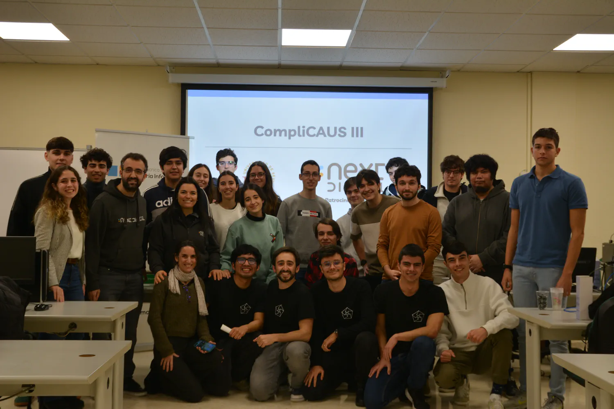
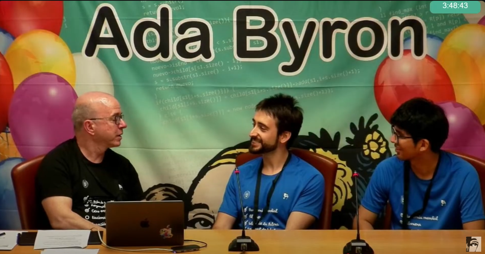

I'm a second-year PhD student and AI Researcher at the University of Seville, passionate about bridging the gap between academic theory and real-world industrial challenges. My goal is to leverage artificial intelligence to drive innovation, optimize complex systems, and build smarter, more efficient solutions.

---

## AI Research and Application

My work is centered on applying advanced AI and Machine Learning to solve critical problems in industrial settings. As a **Specialist Technician** at the University of Seville's Department of Industrial Organization II, I blend rigorous academic research with hands-on implementation.

My academic foundation includes a **Master's Degree in AI** (graduating with Highest Honors) and a Bachelor's in Computer Engineering, where my final thesis focused on Parallel Functional Programming on GPUs.

### Key Projects & Achievements

*   **Predictive Modeling for Elevators (Project HYBLICON):** I am currently designing and developing time-series models (**RNN, LSTM, GRU**) with **PyTorch Lightning** to predict elevator usage patterns. By using **Optuna** for hyperparameter optimization, we aim to dynamically reduce energy consumption and user wait times.
*   **Lead-Time Prediction in Manufacturing (Project INARI):** I implemented Deep Learning (**TabNet, NODE**) and Gradient Boosting (**XGBoost**) models to accurately forecast costs and delivery times for wind turbine components. This work led to **two academic publications**, including an article in the *Mathematics* journal and a book chapter in Springer for the CIO 2024 conference.
*   **Award-Winning Production Optimization (Project OFFSHOREWIND):** I led the development of ML algorithms to optimize the production sequencing of wind towers. This project was honored with the **AEIPRO - IPMA Spain Award for Excellence in Projects**, recognizing its significant impact.

### My Technical Toolbox

*   **Languages:** Python, SQL, Kotlin, Julia
*   **Machine Learning & DS:** PyTorch, Scikit-learn, Pandas, NumPy, XGBoost, PyTorch Lightning, PyCaret, Optuna
*   **ML/DL Architectures:** Regression/Classification Models, Ensembles (Random Forest, Gradient Boosting), Neural Networks (MLP, RNN, LSTM, GRU), TabNet, NODE
*   **DevOps & Tools:** Docker, Git, Linux, Bash, Sphinx, Markdown, LaTeX, Typst

---

## Beyond the Code: Discipline, Focus, and Kung Fu

My passion for problem-solving extends beyond academia. For over a decade, Kung Fu has been a central part of my life, teaching me discipline, resilience, and focus.

*   I hold a **2nd DAN Black Belt** and have been recognized multiple times by the regional government (`Junta de Andalucía`) as a **High-Performance Athlete** for my achievements in national competitions.
*   After years of competing, I transitioned to giving back to the community, serving as a certified **Judge and Referee** at official regional and national championships, ensuring fair play and technical excellence.

This discipline directly translates into my professional life, driving me to approach challenges with persistence and a clear, focused mindset.

---

## Building Communities: Leadership in Tech

I believe in the power of collaboration and community to accelerate learning and innovation. This belief inspired me to take on leadership roles to help others grow.

### Co-Founder of the University of Seville Algorithmics Club

In December 2023, I **co-founded the [Algorithmics Club of the University of Seville](https://clubalgoritmiaus.es/)**. As a leader, I:
*   Organize and lead weekly training sessions on algorithms and data structures.
*   Design and run internal and open programming competitions to foster a spirit of friendly competition and technical excellence.
*   Cultivate an inclusive and collaborative community where members can grow their skills and network.

### Organizer & Judge for the Ada Byron Programming Competition

I also serve as an **organizer and judge** for the regional phase of this prestigious competition. My responsibilities include designing algorithmic problems, managing the automated judging system, and guiding participants from six different universities.

I'm always open to connecting with fellow innovators, researchers, and problem-solvers. Feel free to reach out.

<!-- I'm Kenny, a first-year PhD student at the University of Seville under the guidance of Prof. Alejandro Escudero. My research focuses on the application of artificial intelligence in industrial settings, particularly exploring how AI can enhance production efficiency and decision-making in complex environments. I hold a Master’s degree in Logic, Computing, and Artificial Intelligence from the University of Seville, where I developed a strong foundation in AI, data science, and various programming paradigms.

Currently, I work as a specialist technician in the Department of Industrial Organization and Management of Companies II at the University of Seville. My role involves applying machine learning techniques to optimize Production Planning and Control within the metallurgical industry, blending academic research with practical industry challenges. I have a proven track record of implementing machine learning models using Python, leveraging tools such as Scikit-Learn, NumPy, pandas, PyTorch, and Gradio.

In addition to my expertise in machine learning, I have explored functional programming with Haskell, focusing on the development of parallel algorithms for GPU computing. I am passionate about the transformative power of AI in industrial applications and am constantly seeking new opportunities to drive innovation and solve complex problems. -->
