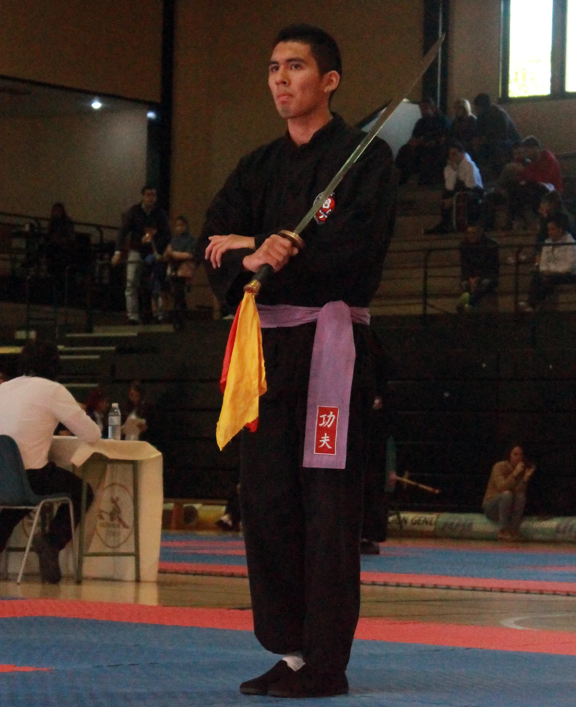
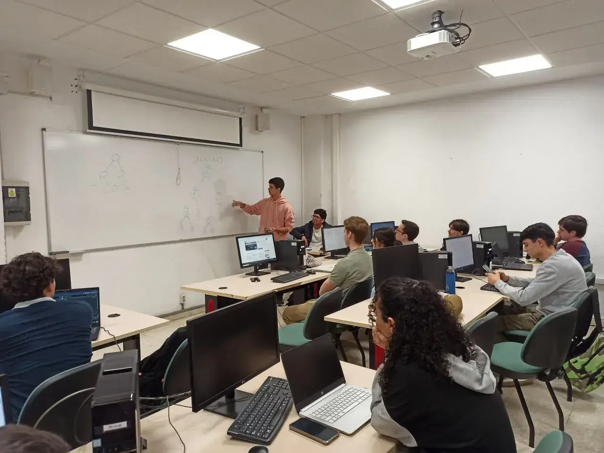
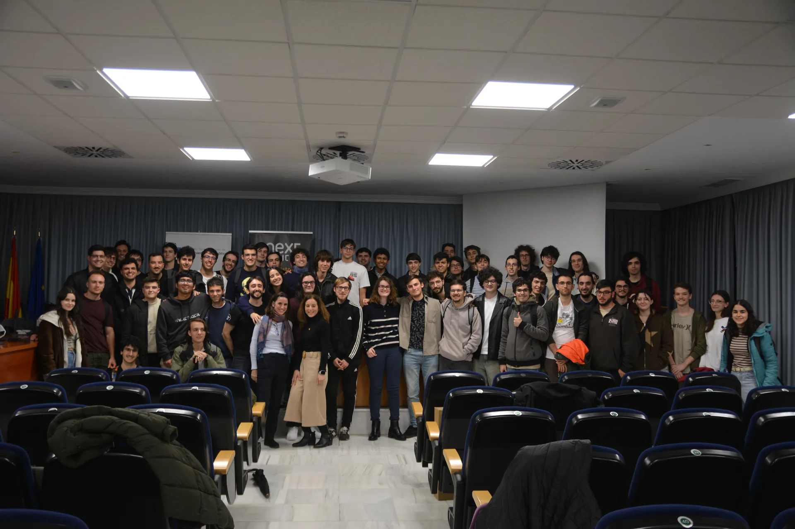
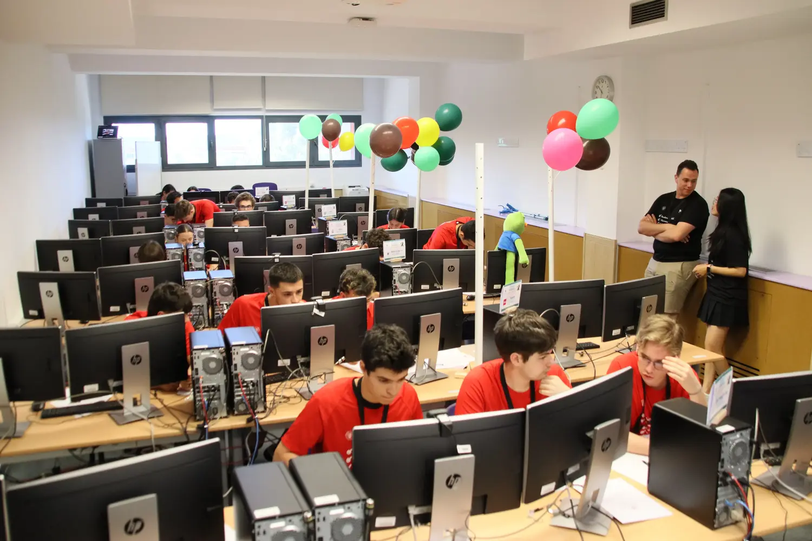
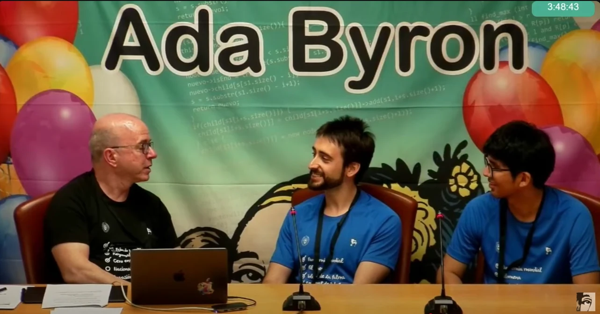

Hi, I'm Kenny. I work as a Data Engineer at Next Digital and I'm pursuing a PhD in Engineering Management at the University of Seville.

## Work

At Next Digital I build data pipelines on AWS: Airflow and dbt to orchestrate and transform, Redshift and S3 to store.

My PhD is the applied side. I train models on real industrial data, like predicting how long each step takes when building a wind tower, or how lifts use energy based on their sensors.

## Kung Fu

I've trained Kung Fu for over ten years. I'm a 2nd DAN black belt and competed nationally long enough to be named a High-Performance Athlete. I don't compete anymore; now I judge and referee. It's where I learned to stay focused under pressure.

## Algorithmics Club

In 2023 I co-founded the [Algorithmics Club of the University of Seville](https://clubalgoritmiaus.es/en). We run weekly sessions on algorithms and competitive programming, and I teach every week.

I also organise the Andalusian round of the Ada Byron Programming Contest: I write the problems and judge the submissions from six universities.

If any of this sounds interesting, or you just want to talk about Kung Fu, send me an email at [kflores1@us.es](mailto:kflores1@us.es).
