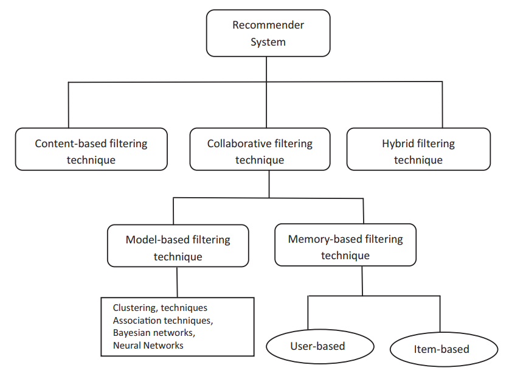
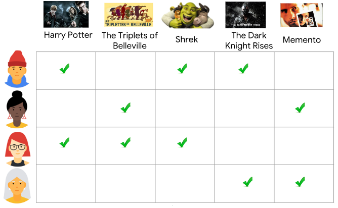
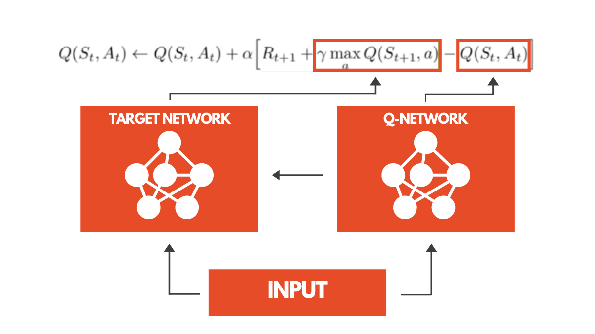
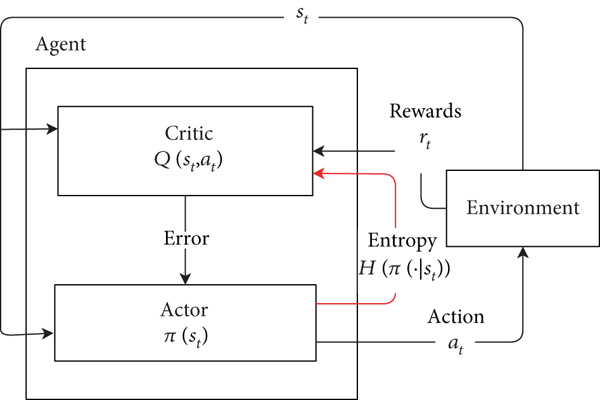
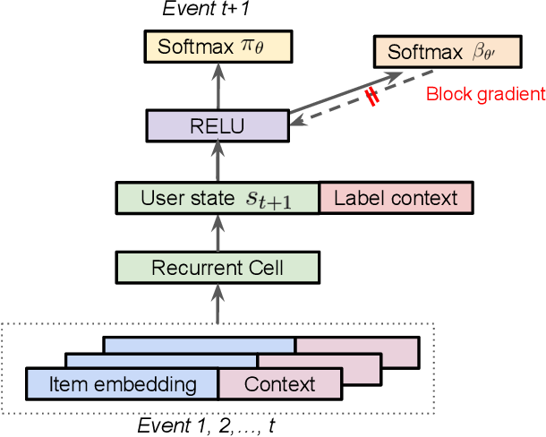
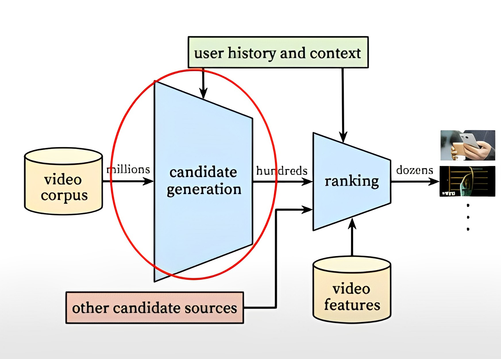
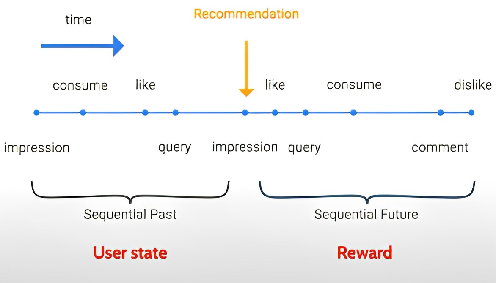
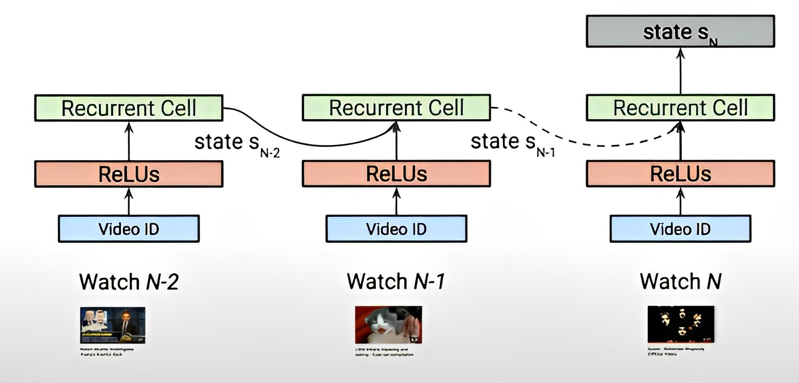
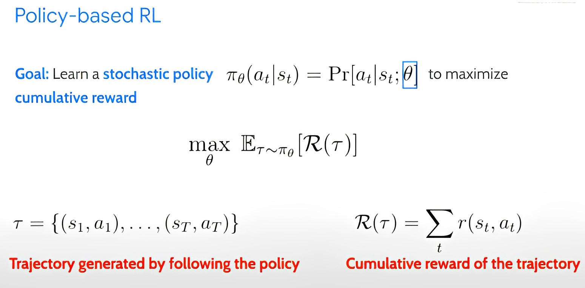



Reinforcement learning has seen significant advancements in robotics and video games, but with the growing importance of generating personalised content for users on online platforms like Netflix or Spotify, building recommendation systems based on reinforcement learning could offer a series of positive improvements compared to traditional supervised learning systems.

In this study, we will discuss the different types of recommendation systems, the challenges we will face when transitioning from traditional systems to the use of reinforcement learning, a practical case where it is being used in the real world, and an overview of current trends and developments in the field.

## 1. Recommendation Systems

**Recommendation systems** (often called "recommender systems") are algorithms that aim to **suggest relevant content or products** to users based on their preferences and other relevant information.

These systems are essential across various industries (such as e-commerce or multimedia entertainment applications) to help users discover content that might interest them, increasing the likelihood that they will remain on the platform and generate revenue for the company.

### 1.1 Traditional Recommendation Systems

Within recommendation systems, there are various techniques that provide valuable and personalised recommendations to each user. The following figure shows the structure of the different traditional techniques.



<!--  -->

Traditionally, these systems are classified into two main categories: those based on **collaborative filtering** and those based on **content**. However, hybrid techniques that combine elements of both approaches will not be addressed in this article.

#### 1.1.1 Collaborative Filtering-Based Recommendation Systems

This method builds a user-item interaction matrix, which collects users' previous interactions with items. Items are the products that are being recommended to the user (songs, films, books, etc.).

This matrix is used to identify similar profiles based on their proximity and learn from their interests to make recommendations to users.




The figure above presents a matrix where each column corresponds to a product to be evaluated, while the rows represent users who have provided ratings for those products. Cells without an assigned value indicate that the user has not yet rated that particular product. The aim, therefore, is to develop a model that predicts the missing interactions in the matrix.

Within the collaborative filtering approach, two types of methods can be identified: **memory-based**, which use information from similar user/product ratings to make recommendations; and **model-based**, which employ machine learning techniques to create a model that accurately predicts user preferences.

##### Memory-Based Methods

In these systems, the previous ratings of a user are used to find a neighbour with similar preferences, then these neighbours’ preferences are combined to generate recommendations.

There are two techniques: **user-based**, which calculate similarity between users by comparing ratings on the same item, and **item-based**, which make predictions by using the similarity between products.

To calculate the similarity (or distance) between users or content, various measures can be used, such as Euclidean, Manhattan, or Jaccard distances. The most popular ones are correlation and cosine similarity.

##### Model-Based Methods

These techniques, on the other hand, develop models using machine learning algorithms on the utility matrix to predict users' ratings for unrated items.

##### Advantages and Disadvantages of Collaborative Filtering-Based Systems

These systems can recommend products even when there are no user ratings, adapt to changes in user preferences, and provide relevant recommendations without sharing user profile information.

However, disadvantages include the **cold start** problem, where a recommendation system lacks sufficient information about a user or product to make relevant predictions; **data sparsity**, caused by the lack of rated items in the database; the **scalability** problem, where calculations increase linearly with the number of users and items; and the **synonymy** problem, where systems struggle to distinguish between very similar products.

#### 1.1.2 Content-Based Recommendation Systems

This technique does not rely on the user's action history but rather uses information about the product's content to find similarities and recommend similar products to those the user has already shown interest in.

These models can be based on the **vector space model**, such as Term Frequency-Inverse Document Frequency (TF-IDF), or **probabilistic models**, like Naive Bayes, decision trees, or neural networks.

Advantages of this technique include independence from other users' profile information, as their preferences do not influence recommendations. It also has the ability to quickly adjust recommendations if a user's profile changes, and it can provide explanations for how recommendations were generated.

The main disadvantage is that a broad knowledge and detailed description of the item's characteristics in the profile are required.

### 1.2 Evaluation Metrics for Recommendation Algorithms

The quality of a recommendation algorithm can be evaluated using different types of measures, such as accuracy or coverage.

Accuracy metrics are divided into **statistical accuracy metrics** and **decision-support accuracy metrics**.

**Statistical accuracy metrics** directly compare predicted ratings with actual ratings. One of the most important metrics to evaluate these systems is the Mean Absolute Error (MAE), defined as:

$$
MAE = \frac{1}{N} \sum_{u,i}^{N} |p_{u,i} - r_{u,i}|
$$


where \\( p_{u,i} \\) is the predicted rating for user \\( u \\) on item \\( i \\), \\( r_{u,i} \\) is the actual rating, and \\( N \\) is the total number of ratings.


**Decision-support accuracy metrics** help users select high-quality items from the available set. Among the most popular are Precision and Recall. The notation **P@K** is used to indicate Precision for a recommendation of **K** objects, and **R@K** for Recall:

$$
 P@K = \frac{|\text{Relevant items in top K} |}{K}
$$

$$
 R@K = \frac{|\text{Relevant items in top K} |}{\text{Relevant items}}
$$

In addition to metrics, systems can also be evaluated by their coverage, referring to the percentage of items and users for which a recommendation system can provide predictions. Prediction can be almost impossible if no users or very few users rate an item. Coverage may be reduced by defining small neighbourhoods for users or products.

### 1.3 Limitations of Supervised Learning

These traditional recommendation methods, such as deep neural network-based recommendation systems, are heavily influenced by machine learning techniques, and they present some limitations that we will discuss below.

#### Short-Sighted Recommendation

Traditional recommendation systems have the issue of providing suggestions that likely lead to immediate responses, often resulting in recommending content a user has previously consumed (short-sighted recommendation).

This can lead to users being trapped in a "recommendation bubble", where they are exposed to an increasingly narrow set of content. In the worst case, it could damage user trust in the long term.

#### System Bias

Another problem is that these systems often fail to consider additional factors such as user preferences or system bias, which can result in inaccurate or irrelevant recommendations.


## 2. Recommendation Systems Based on RL

Given the limitations of traditional recommendation systems, we can use **reinforcement learning** (RL) to give a new approach to recommending content to users.

The goal is to capture and discover the dynamic preferences of users to maximize their satisfaction within the platform. This is possible through the **reinforcement learning paradigm**, as it can continuously learn and balance showing both relevant and new content to generate new user interests.

However, applying this paradigm is not straightforward and comes with several challenges that need to be addressed.

### 2.1 What is Reinforcement Learning?

**Reinforcement learning** (RL) is the technique closest to human learning that can be achieved with current systems. RL consists of modeling the interaction of an agent (like a robot or a machine) within an environment over time to guide its learning process.


<!--  -->

The agent is placed in an unknown environment, where it must make decisions to reach a specific goal. Through trial and error, the agent learns which actions lead to positive outcomes (which it will repeat) and which actions result in negative outcomes (which it will avoid).

In these systems, the set of possible states is defined as \\( S \\), with a particular state \\( s \in S \\). The set of possible actions is \\( A \\), with a particular action \\( a \in A \\), and the set of possible rewards is \\( R \\), with a particular reward \\( r \in R \\).

Reinforcement learning has a wide range of applications, including natural language processing, marketing, and automated robots. However, its application in recommendation systems is particularly interesting.

### 2.2 Elements of Reinforcement Learning

In addition to the agent and environment, it is important to identify other key elements in RL.

#### Policy

A **policy** is a function that determines which action to take in a given state. It can be a deterministic policy, where a single action is taken with probability 1, or a stochastic policy, which defines a probability distribution over multiple actions for each state.

The policy is the core of RL, as it stores the agent's learning. The goal is to learn an **optimal policy**.

#### Reward Signals

During iterations in the RL system, the environment sends a numerical value called **reward**, which can be defined as a function of the state $f: S \rightarrow R$. The sole objective of the agent is to maximize the cumulative reward it receives over time, which serves as a quality metric at a specific moment $t$.

#### Value Functions

While rewards are immediate and assigned to the current state, **value functions** consider long-term desirability. The value function represents the total expected reward an agent can accumulate starting from a particular state.

From a human perspective, rewards would be analogous to immediate pleasure or pain, while value functions represent a more forward-looking evaluation of our satisfaction with the current state.

### 2.3 Why Use RL in Recommendation Algorithms?

The use of **Reinforcement Learning (RL)** in recommendation systems is justified by the **sequential nature** of the interaction between the user and the system. This problem can be modeled as a Markov process and solved using RL algorithms.

RL offers three unique advantages not found in traditional recommendation systems:

1. Ability to handle the sequential interaction dynamics between the user and the system.
2. Consideration of long-term user engagement in decision-making.
3. Capability to optimize the recommendation policy without explicit user ratings.

### 2.4 RL Algorithms in Recommendation Systems

The goal of using RL in recommendation systems is to find the **optimal policy** that maximizes the expected cumulative reward over time, providing more accurate and personalized recommendations to users.

#### 2.4.1 Deep Q Learning

As previously mentioned, using the classic **Q-Learning** method in real-world problems is computationally infeasible due to the large state and action spaces. In 2015, **DeepMind** introduced **DQN** (Deep Q Network), which marked the beginning of **Deep Reinforcement Learning**.


This architecture uses a deep neural network instead of a table to estimate the Q-function, making it more efficient in terms of memory.

##### Deep Q Learning with Experience Replay

DQN includes the **experience replay** technique, which stores information obtained after each interaction in memory and uses it to train the model later. This ensures that the information obtained is better utilized, improving the learning process.

##### Double Deep Q-Learning

**Double DQN** addresses the problem of **overestimation** in reinforcement learning. This issue arises when the Q-values overestimate the potential reward. Double DQN solves this problem by using two neural networks: one to select the action and another to evaluate the chosen action.



##### Dueling Deep Q-Learning

**Dueling DQN** is a variant of the DQN algorithm that proposes a new way to compute Q-values. The neural network is split into two parts: one estimates the **state-value function** \\( V(s) \\), while the other estimates the **advantage function** \\( A(s,a) \\).

The final layer combines these values through a specific aggregation to adjust the final Q-value. This approach improves learning efficiency, though it can lead to "unidentifiable" problems during training.

To address this, it forces the highest Q-value to be equal to \\( V \\), while the highest value in the advantage function is zero, and the rest are negative.


#### 2.4.2 Soft Actor-Critic (SAC)

**Soft Actor-Critic (SAC)** is a model-free, off-policy reinforcement learning algorithm developed by experts from UC Berkeley and Google. It focuses on maximizing both the expected return and the expected entropy of the policy, which allows for more efficient exploration of the action space.



This technique is implemented by parameterizing a Gaussian policy and a Q-function using a neural network and optimizing them using approximate dynamic programming.

#### 2.4.3 REINFORCE Top-K Off-Policy Correction



The **REINFORCE Top-K Off-Policy Correction** algorithm is based on the REINFORCE algorithm and uses recorded data as a behavior policy to generate a new target policy. However, since the data is generated by the model itself, it may be highly biased, so this algorithm learns from biased data to correct those biases.

In addition, **Top-K Off-Policy Correction** is introduced, where the agent learns to maximize K rewards instead of just one, selecting the TOP-K.

In summary, the **REINFORCE Top-K Off-Policy Correction** algorithm uses policy correction and selection of the K most promising actions to improve learning efficiency and stability in an RL environment.

### 2.5 Challenges in Applying Reinforcement Learning to Recommendation Systems

While RL addresses several issues with traditional recommendation systems, it introduces new challenges when put into practice.

#### Large Action Space

This refers to the vast number of possible actions a recommendation system based on RL must consider at any given moment.

For example, in a system recommending YouTube videos, the action space includes the massive number of videos available on the platform.

The large action space represents a major challenge, as the larger the action space, the more complex it becomes to learn user preferences and select the most suitable items (e.g., videos) to recommend.

#### Costly Exploration

Exploration can be costly in these systems because it requires testing different actions and adapting to changes in user preferences. However, it is crucial to perform effective exploration because recommending random content could result in a poor user experience.

#### Off-Policy Learning

**Off-policy learning** allows the system to learn from past experiences different from the current policy, improving its ability to adapt to new situations. However, implementing this technique can be challenging due to the complexity in selecting and processing training data.

#### Partial Observability

When building a recommendation system, the user does not explicitly inform what they are interested in, so the system must infer user interests from their activities on the platform.

#### Noisy Rewards

**Noisy rewards** refer to the scattered and unclear feedback from users. This could be due to many reasons, such as lack of contextual information, discomfort in providing feedback, or simply because the user doesn’t know what they want. Finding ways to minimize this noise is crucial.

## 3. Applications

### 3.1 RecNN: Recommendation Toolkit

[RecNN](https://github.com/awarebayes/RecNN) is a library focused on reinforcement learning for news recommendation systems.

The main innovation is online learning, meaning there is no need to follow a pre-established policy. Additionally, it uses dynamically generated *embeddings*, meaning that the representation vectors for items (such as news articles) are created and updated in real-time, allowing for a more accurate and up-to-date representation of the items.

#### 3.1.1 Features

- **Control over abstraction level**: You can import a complete algorithm and tell it to train, import networks and their learning functions separately, create a custom loader for your task, or define everything yourself. You can even define your own data.

- State representation module with various methods.

- **Learning** is based on a sequential or frame environment that supports variable-length data, such as ML20M. The sequence (seq) is a complete sequence of dynamic size (under development), while the frame (frame) is just a static frame.

- **Parallel data loading with Modin (Dask/Ray) and caching**.

- Supports Pytorch 1.7 with *Tensorboard* visualization.

#### 3.1.2 Getting Started

##### Import the Library

```python
import recnn
```

##### Set Up the Environment

When working with recommendation environments, you have the option to use static-length inputs or dynamic-length time series with sequential encoders.

In this case, we will use static length via the `FrameEnv` class.

```python
frame_size = 10
batch_size = 25
env = recnn.data.env.FrameEnv("ml20_pca128.pkl", "ml-20m/ratings.csv", frame_size, batch_size)
```

##### Retrieve the Data

```python
train = env.train_batch()
test = env.train_batch()
state, action, reward, next_state, done = recnn.data.get_base_batch(train, device=torch.device('cpu'))
```

##### Initialize the Main Networks

```python
value_net = recnn.nn.Critic(1290, 128, 256, 54e-2)
policy_net = recnn.nn.Actor(1290, 128, 256, 6e-1)
```

##### Attempt to Recommend

```python
recommendation = policy_net(state)
value = value_net(state, recommendation)
```

##### Choose to Import a Preferred RL Algorithm

```python
ddpg = recnn.nn.DDPG(policy_net, value_net)
plotter = recnn.utils.Plotter(ddpg.loss_layout, [['value', 'policy']])
```

##### Start Training the Algorithm

```python
for epoch in range(n_epochs):
    for batch in tqdm(env.train_dataloader):
        loss = ddpg.update(batch, learn=True)
        plotter.log_losses(loss)
        ddpg.step()
```

For more information, check out the official documentation [here](https://recnn.readthedocs.io/en/latest/).

### 3.2 RL4RS

[RL4RS](https://github.com/fuxiAIlab/RL4RS) is a reinforcement learning-based recommendation system for professionals and researchers.

This library aims to address common issues in RL-based recommendation systems, such as the gap with reality and lack of validation before deployment.

#### 3.2.1 Features

- **Data Understanding Tool**: RL4RS provides a data understanding tool to test the appropriate use of RL on recommendation system datasets.

- This library is compatible with leading RL libraries such as RLlib and Tianshou, and provides example code for model-free algorithms for both discrete and continuous environments, as well as offline reinforcement learning algorithm implementations.

- **Easy-to-use and Scalable API**: The RL4RS library has a user-friendly and scalable code structure with low coupling to reduce dependencies. It features a file-based gym environment that allows random sampling and sequential access to large datasets, and can be extended to distributed file systems. It also supports Vector Env and is encapsulated in an HTTP interface for deployment across multiple servers, accelerating sample generation.

#### 3.2.2 Getting Started

##### Import the Libraries

```python
import gym
from rl4rs.env.slate import SlateRecEnv, SlateState
```

##### Set Up the Simulation Environment

```python
sim = SlateRecEnv(config, state_cls=SlateState)
env = gym.make('SlateRecEnv-v0', recsim=sim)
```

##### Train the Model

```python
for i in range(epoch):
    obs = env.reset()
    for j in range(config["max_steps"]):
        action = env.offline_action
        next_obs, reward, done, info = env.step(action)
        if done[0]:
            break
```


## 4. Practical Case: RL for YouTube Video Recommendation Systems

In this section, we will analyze a real-world case of implementing a reinforcement learning-based recommendation system. In this case, it will be YouTube video recommendation, developed by Google.

### 4.1 Introduction

Access to online content has become a necessity, with YouTube being one of the most popular platforms where millions of people consume videos every day. However, traditional systems might lead to users getting trapped in a "bubble" or receiving irrelevant recommendations, causing a loss of trust. The goal is to adapt to and discover users' dynamic preferences to optimize long-term utility, which can be achieved through reinforcement learning.

### 4.2 Candidate Generation

The system that produces YouTube video recommendations is a multi-stage recommender that selects dozens of videos for users from a corpus consisting of billions of videos.



This study focuses only on the **candidate generation** stage, where the video corpus is narrowed down to a few hundred more relevant videos to move on to the next stage.

Several challenges have been encountered in building this structure, as the recommendation system must handle billions of users with changing preferences over time, billions of videos with few views but relevant to a small group of users (cold-start problem), and noisy and sparse user feedback.

### 4.3 Reinforcement Learning in Recommendation Systems

Once we understand the concept of candidate generation, we will base it on reinforcement learning.

The goal is to build agents that perform actions in an environment to maximize a notion of cumulative reward. In this context, our **agent** is the candidate generator, the **states** are user interests and recommendation contacts, the **reward** is user satisfaction, and the **actions** the agent can take involve selecting and proposing videos to be included in a catalog of millions of videos.

### 4.4 Model Construction

In this section, we will see how YouTube developers have constructed the video recommendation agent using reinforcement learning.

#### Agent and Reward

The data source used to build the agent is user trajectory, i.e., a sequence of activities performed by the user on the platform (such as watched videos, searches, etc.).



This information is divided into **past sequential trajectory**, composed of activities before the agent's recommendations, and **future sequential trajectory**, containing information about activities the user has performed after receiving the agent's recommendations.

The presentation author mentions using the past sequential trajectory to arrive at the "user state belief" and using the **future trajectory** to derive the reward.

#### States



<!--  -->

One of the major challenges in building state representation is partial observability because users do not provide information about their interests or how satisfied they are with the recommendations given. To address this challenge, recurrent neural networks (RNNs) are used to analyze prior user activity and obtain a state representation.

#### Actions

In this case, a policy-based approach is used because we want to directly maximize long-term reward, which is more stable than a value-based approach.

We are trying to learn a stochastic policy (Pi theta) that will issue a distribution over the action-state space, aiming to maximize long-term accumulated reward.




The trajectory $\tau$ is generated following this policy, and the accumulated reward is the total sum of rewards over the entire trajectory. Additionally, policy parameters can be optimized through gradient ascent.

As a result, it can be said that reinforcement learning is closely related to supervised learning because it is optimized for the likelihood of observing the next action. However, the reinforcement learning paradigm offers a way to think about exploration, planning, and changes in the underlying user state.

A sampling technique is used to handle the very large action space and perform quick neighborhood searches to reduce processing time.

### 4.5 Addressing Machine Learning Limitations

In this part, we will see how they have addressed the two limitations of traditional recommendation systems.

#### Myopic Recommendation

To tackle the problem of myopic recommendation, the solution is to incorporate future rewards rather than only considering immediate rewards.

In experiments, incorporating these future rewards led to a 0.3% gain in the online matrix.

#### System Bias

This system only has access to log data generated by an agent updated every 5 hours, which means the agent's policy may be very different from the target policy being learned. Therefore, the team continues to study how to handle system bias caused by having access only to these log data.

## 5. Conclusions

In conclusion, reinforcement learning in recommendation systems offers unique features that allow for better suggestions compared to traditional recommendation systems.

On the other hand, within reinforcement learning-based recommendation systems, traditional algorithms like policy iteration or Q-Learning do not adequately meet expectations in the recommendation domain.

Similarly, there are specialized libraries for creating reinforcement learning-based recommendation environments.

Additionally, it is noteworthy that many digital platforms like YouTube use reinforcement learning to improve the accuracy of their recommendation algorithms.

## 6. References


- F.O. Isinkaye, Y.O. Folajimi, & B.A. Ojokoh (2015). Recommendation systems: Principles, methods and evaluation. Egyptian Informatics Journal, 16(3), 261-273.

- Srinivasan, A. (2022, January 31). Recommendation Systems using Reinforcement Learning. Medium. https://medium.com/ibm-data-ai/recommendation-systems-using-reinforcement-learning-de6379eecfde

- Mnih, V., Kavukcuoglu, K., Silver, D., Graves, A., Antonoglou, I., Wierstra, D., & Riedmiller, M. (2013). Playing Atari with Deep Reinforcement Learning. ArXiv: Learning. http://cs.nyu.edu/~koray/publis/mnih-atari-2013.pdf

- Hasselt, H., Guez, A., & Silver, D.. (2015). Deep Reinforcement Learning with Double Q-learning.

- Wang, Z., Schaul, T., Hessel, M., Hasselt, H., Lanctot, M., & Freitas, N.. (2015). Dueling Network Architectures for Deep Reinforcement Learning.

- M Scherbina. (2019). RecNN: RL Recommendation with PyTorch.

- Kai Wang, Zhene Zou, Yue Shang, Qilin Deng, Minghao Zhao, Runze Wu, Xudong Shen, Tangjie Lyu, & Changjie Fan (2021). RL4RS: A Real-World Benchmark for Reinforcement Learning based Recommender System. ArXiv, abs/2110.11073.
- Association for Computing Machinery (ACM). (2019, March 28). “Reinforcement Learning for Recommender Systems: A Case Study on Youtube,” by Minmin Chen [Video]()
