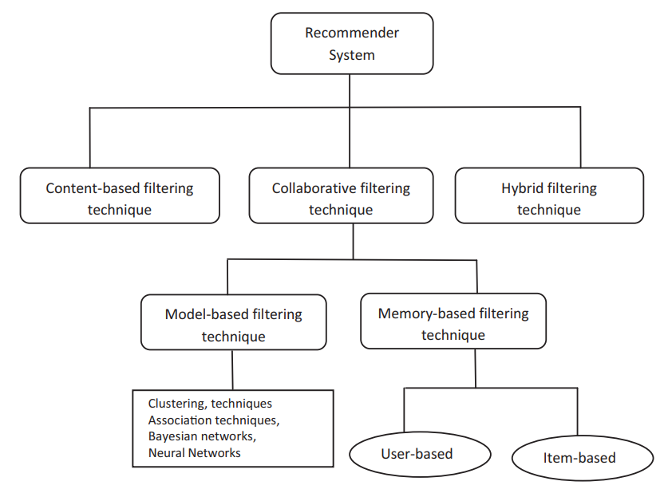
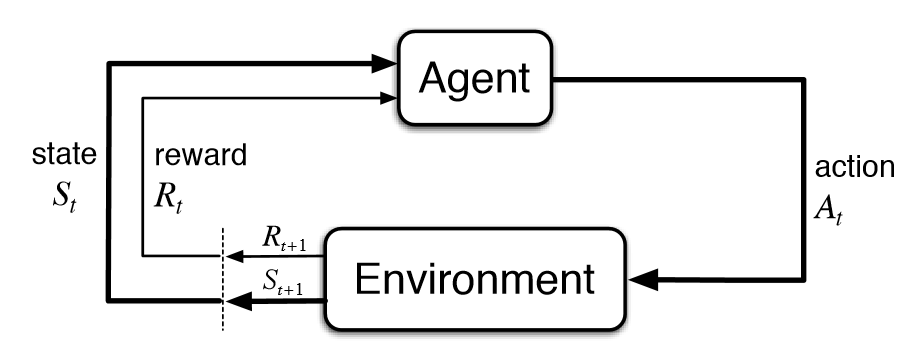
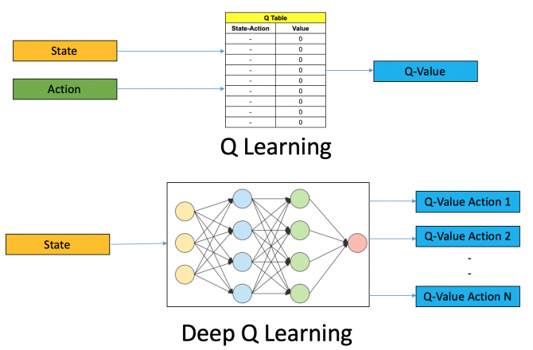
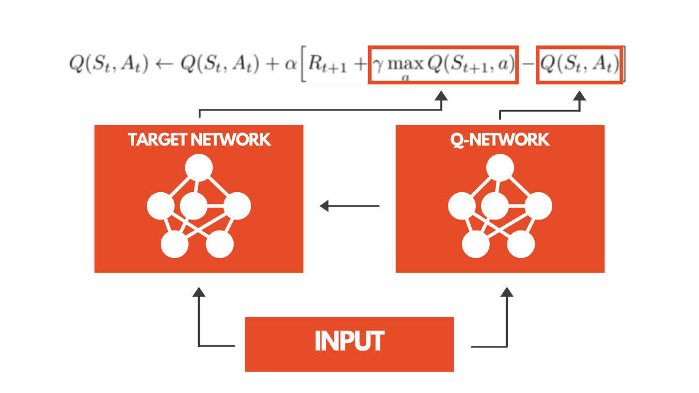
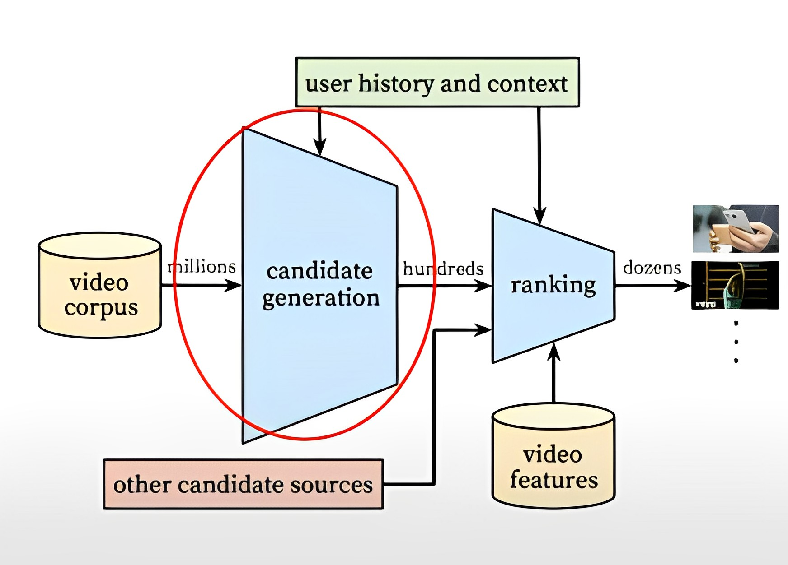
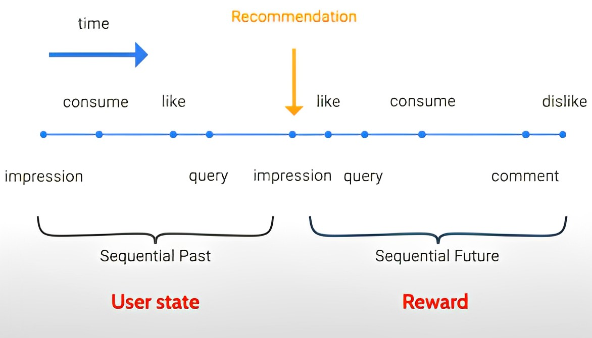
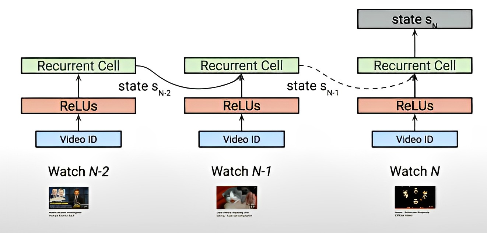
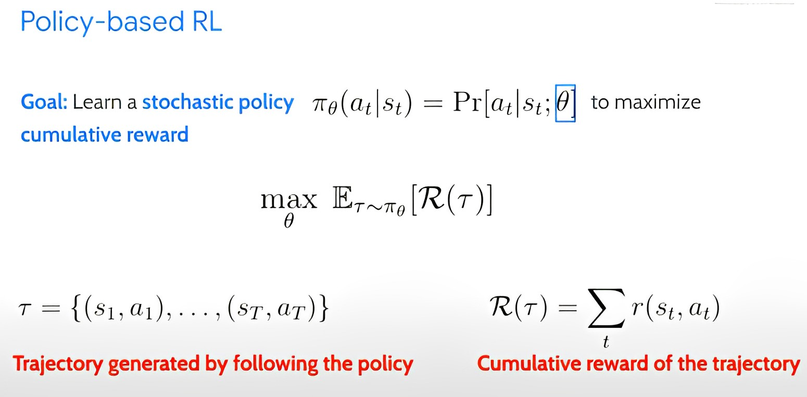

El aprendizaje por refuerzo ha tenido grandes avances en la robótica y en los videojuegos, pero con la creciente importancia de generar contenido personalizado al usuario en las plataformas en línea como Netflix o Spotify, el generar sistemas de recomendación basados en aprendizaje por refuerzo puede ofrecernos una serie de mejoras positivas a diferencia de los sistemas tradicionales basados en aprendizaje supervisado.

En este estudio se discutirá los diferentes tipos de sistemas de recomendación, los desafíos a los que tendremos que enfrentarnos del pasar de los sistemas tradicionales al uso de aprendizaje reforzado, un caso práctico donde se está usando en el mundo real, y una visión general de las tendencias y desarrollos actuales en el campo.

## 1. Sistemas de recomendación

Los sistemas de recomendación (o llamados en inglés "recommender systems") son algoritmos que buscan sugerir contenido o productos relevantes al usuario, en base a sus preferencias y otras informaciones relevantes.

Estos sistemas son fundamentales en diferentes industrias (como el comercio electrónico o aplicaciones de entrenimiento multimedia) para descubrir el contenido que les interesaría al usuario, haciendo que aumente la probabilidad de que se retengan en la plataforma y generen ingresos para la empresa.


### 1.1 Sistemas de recomendación tradicionales

Dentro de los sistemas de recomendación existen diversas técnicas que nos brinden recomendaciones valiosas y personalizadas a cada usuario. Por lo que la siguiente figura muestra la estructura de las diferentes técnicas que existen de forma tradicional.



Por tradición, estos sistemas se han agrupado en dos paradigmas muy importantes: **basados en filtro colaborativo** y  **basados en contenido**.


#### 1.1.1 Sistemas de recomendación basados en filtro colaborativo

Este método construye una matriz de interacción usuario-elemento, que recoge las interacciones previas de los usuarios con los elementos.

Los elementos o items son los productos que se quieren recomendar al usuario (canciones, películas, libros, entre otros).

Se hace uso de esta matriz para idenfiticar los perfiles similares en función de su proximidad y aprender de sus intereses para recomendar a los usuarios. 

")

En la figura anterior, se puede observar que tenemos una matriz donde las columnas son los productos que queremos valorar, y las filas son los usuarios que le dan una valoración a esos productos.

Las casillas que no están con ninguna valoración significan que el usuario aún no ha probado ese producto. Por lo cual nuestro objetivo es encontrar un modelo que prediga las interacciones que faltan en la matriz.

Dentro de este paradigma existen dos tipos de filtro colaborativo: **basados en memoria** y **basados en modelos**

<!--
(https://impulsatek.com/11-sistemas-de-recomendacion-y-modelos-de-aprendizaje-basados-en-grafos/#Sistemas_basados_en_filtrado_colaborativo)
-->

##### Basados en memoria

<!-- Buscar paper: Recommendation systems: Principles, methods and
evaluation -->

En estos tipos de sistemas, hacen uso de las calificaciones previas de un usuario para encontrar a un vecino con preferencias similares para posteriormente combinar esas preferencias de los vecinos para generar recomendaciones.

Existen dos técnicas: las **basadas en usuario** que calculan la similitud entre usuarios comparando las valoraciones sobre un mismo elemento, mientras que las **basadas en elemento** hacen predicciones haciendo uso del parecido entre los productos.

La similitud (o distancia) entre usuarios o contenido puede ser calculado empleando distancias como la euclídea, Manhattan, Jaccard, entre otras muchas. Las más populares son la correlación y la similitud coseno. <!-- Referenciar el paper de recommendation systems, principles, methods and evaluation.-->

##### Basados en modelos

En cambio, estas técnicas desarrollan modelos haciendo uso de algoritmos de aprendizaje automático sobre la matriz de utilidad para realizar una predicción de las valoraciones de los usuarios en los elementos no valorados.


##### Ventajas y desventajas de los sistemas basados en filtro colaborativo

Estos sistemas tienen la capacidad para recomendar productos incluso si no hay valoraciones de los usuarios, además de adaptarse a los cambios en las preferencias de los usuarios y proporcionar recomendaciones relevantes sin compartir información del perfil del usuario.

Entre las desventajas, podemos encontrarnos el problema del **comienzo en frío**, cuando un sistema de recomendación no tiene suficiente información sobre un usuario o un producto para hacer predicciones relevantes, el problema de **dispersión de los datos**, consecuencia de la falta de elementos valorados en nuestra base de datos, el problema de la **escalabilidad** asociado a que los cálculos crecen linealmente con el número de usuarios y elementos, y el problema de la **sinonimia**, cuando los sistemas tiene dificultades para distinguir entre productos muy similares.

#### 1.1.2 Sistemas de recomendación basados en contenido

Esta técnica en lugar de basarse en el historial de acciones del usuario, estos métodos hacen uso de la información sobre el contenido de los productos para encontrar similitudes y poder recomendar productos similares a los que el usuario ya ha mostrado interés.

Estos modelos pueden ser basados en el **modelo de espacio de espacio vectorial**, como podría ser la frecuencia de término - frecuencia inversa de documento (TF/idf), o **modelos probabilísticos**, como Naive Bayes, árboles de decisión o redes neuronales.

Las ventajas que podemos decir de esta técnica es que no dependemos de la información de perfil de otros usuarios, debido a que uno influyen en las recomendaciones. Además, se tiene la capacidad de poder ajustar sus recomendaciones en un corto periodo de tiempo si el perfil de un usuario cambia como la de también proporcionar explicaciones sobre cómo se generaron las recomendaciones.

La mayor desventaja de poder usar este paradigma es que tenemos que tener un amplio conocimiento y una descripción detallada de las características de los elementos en el perfil.

### 1.2 Métricas de evaluación para algoritmos de recomendación

La calidad de un algoritmo de recomendación puede evaluarse haciendo uso de distintos tipos de medidas, como lo pueden ser la precisión o la cobertura.

Dentro de las métricas para medir la precisión de estos sistemas se dividen en métricas de precisión estadística y apoyo a la precisión de la decisión.

Las métricas de **precisión estadística** comparan directamente las valoraciones predicas con las valoraciones reales. Una de las métricas más importantes para evaluar este tipo de sistemas sería el Error Medio Absoluto (o *Mean Absolute Error* (MAE) en inglés). Constaría de la siguiente definición:


$$MAE = \frac{1}{N} \sum_{u,i}^{N} |p_{u,i} - r_{u,i}|$$

donde $P_{u,i}$ es la valoración prevista para el usuario $u$ en el item $i$ ,$r_{u,i}$ es la valoración real y N es el número total de valoraciones.

Las métricas **de apoyo a la precisión de la decisión** ayudan a los usuarios a seleccionar los elementos de alta calidad entre el conjunto disponible, entre las más populares nos encontramos la Precisión y el Recall. Se suele hacer uso de la notación **P@K**, para indicar la Precisión de una recomendación de **K** objetos, o **R@K**, de forma análoga para el Recall:

$$ P@K = \frac{|\text{Objetos relevantes en top K} |}{K}$$

$$ R@K = \frac{|\text{Objetos relevantes en top K} |}{\text{Objetos relevantes}}$$

Además de las métricas, podemos evaluar el sistema por su cobertura, que se refiere al porcentaje de items y usuarios para los cuales un sistema de recomendación puede proporcionar predicciones. La predicción puede ser prácticamente imposible si ningún usuario o pocos usuarios valoran un elemento. La cobertura puede reducirse definiendo vecindarios pequeños para los usuarios o productos.


### 1.3 Limitaciones del aprendizaje supervisado

Estos métodos tradicionales de recomendación están muy influenciados por técnicas de aprendizaje automático, y estos presentan algunas limitaciones que discutiremos a continuación.

#### Recomendación miope


Los sistemas de recomendación tradicionales tienen el problema de dar recomendaciones que probablemente te lleven a una respuesta inmediata, además de llevarte a resultados que tienden a recomendar un contenido que un usuario ha consumido previamente (recomendación miope). 

El que ocurra esto puede llevar a que un usuario acabe encerrado en una "burbuja de recomendación", en la cual un usuario se ve expuesto a un conjunto cada vez más estrecho de contenido.Y  en el peor de los casos, podría dañar la confianza de los usuarios a largo plazo.

#### Sesgo del sistema
<!-- System bias -->

Otro problema que nos podemos encontrar en estos sistemas es que no tienen en cuenta factores adicionales como las preferencias del usuario o el sesgo del sistema, lo que puede resultar en recomendaciones poco precisas o irrelevantes.

## 2 Sistemas de recomendación con RL

Viendo las limitaciones que tiene el usar los sistemas de recomendación tradicionales, podemos hacer uso de aprendizaje por refuerzo para darle un nuevo enfoque al recomendar contenido a los usuarios.

<!-- Podríamos decir  "dinámicas del usuario para opimizar su utilidad a largo plazo -->
El objetivo sería asegurar y descubrir las preferencias dinámicas del usuario para maximizar su satisfacción dentro de la plataforma, esto es posible con el paradigma del aprendizaje por refuerzo, debido a que es capaz de aprender contínuamente y equilibrar el mostrarle tanto contenido relevante para el usuario como presentarle contenido novedoso que le genere nuevos intereses.

Aunque obviamente aplicar este paradigma no es tan sencillo, ya que nos encontraremos una serie de desafíos que vamos a tener que resolver.

### 2.1 ¿Qué es el aprendizaje por refuerzo?

El aprendizaje por refuerzo (Reinforce Learning en inglés) es la técnica más cercana al aprendizaje humano que se pueden conseguir en los sistemas actuales. 

El paradigma del Aprendizaje por Refuerzo consiste en modelar la interacción en un agente (como podría ser un robot  o una máquina) en un entorno, a través del tiempo, para guiar su aprendizaje.



El agente se le coloca en un entorno desconocido, donde debe tomar decisiones para alcanzar un objetivo específico, que mediante prueba y error, el agente aprende cuales acciones llevan a un resultado positivo, por lo cual las irá repitiendo, mientras que las acciones que lo lleven por un resultado negativo las va a ir evitando.

En estos sistemas, se suele definir el conjunto de estados posibles como $S$, siendo uno de estos estados $s \in S$. El conjunto de acciones posibles $A$, siendo $a \in A$, y el de recompensas posibles como $R$, siendo una de esas recompensas $r \in R$.

El Aprendizaje por refuerzo tiene una gran variedad de aplicaciones como en el procesamiento del lenguaje natural, marketing o robots automatizados. Pero veremos que puede tener un uso muy interesante en los sistemas de recomendaciones.

### 2.2 Elementos del Aprendizaje por Refuerzo
<!-- Richard S. Sutton y Andrew G. Barto. Reinforcement Learning: An Introduction.
Second. The MIT Press, 2018. url: http://incompleteideas.net/book/thebook-2nd.html -->

Además del agente y el entorno, es importante identificar otros elementos importantes dentro del RL.

#### Política

Una política es una función que determina que acción tomar en un estado determinado. Puede ser una política estática, que indica una única acción con probabilidad 1, o una política estocástica, que define una distribución de probabilidades sobre varias acciones para cada estado.

La política es el centro del RL debido a que es en ella donde se almacena el aprendizaje del agente. El objetivo es aprender una política óptima

#### Señales de recompensa

Durante las iteraciones de un sistema de Aprendizaje Automático, el entorno envía al agente un número llamado recompensa, que se puede definir como función del estado $f : S \rightarrow R$. 

El único objetivo del agente es maximizar esta recompensa total que recibe a largo plazo como una heurística que puede usarse como métrica de calidad en un momento $t$ determinado.

La recompensa solo depende del estado actual del entorno y el único modo en que el agente puede influir en ella es a través de las acciones que toma, las cuales producen un cambio de estado y una recompensa diferente por ser parte del entorno.

#### Funciones de valor

Las recompensas del entorno son inmediatas, que se otorgan al estado actual. Sin embargo, existe una variante análoga a la recompensa que tiene en cuenta la deseabilidad a largo plazo. Esta se denomina **función de valor**, y sería la cantidad total de recompensa que un agente espera acumular, partiendo desde ese estado.

Viéndolo desde la perspectiva humana, las recompensas serían algo como el placer (si es alto) o el dolor (si es bajo), sensaciones momentáneas, mientras que los valores de la función de valor corresponden a una evaluación más detallada y con visión a futuro de nuestra satisfacción o incomodidad con el estado actual del entorno.

### 2.3 Algoritmos de RL en sistemas de recomendación

El objetivo que tenemos al hacer uso del Aprendizaje por Refuerzo en los sistemas de recomendación es encontrar la política óptima que maximice la recompensa esperada obtenida por el agente a lo largo del tiempo, y así poder brindar recomendaciones más precisas y personalizadas para los usuarios.

Los algoritmos más populares son los pertenecientes a la rama de Programación Dinámica como pueden ser **Polity iteration** o el **Value iteration**, pero estos no se adecúan al paradigma de la recomendación. Esto es debido a que en estos algoritmos es necesario conocer de antemano las recompensas y las probabilidades. Sin embargo, este conocimiento previo no es posible en los problemas de recomendación, ya que las recompensas no se conoce la recompensa de la acción hasta que se realiza y no se conocen las probabilidades de transición a priori, ya que no sabemos si un producto recomendado le gustará al usuario hasta que se realice esa recomendación.

Otra rama también muy popular son los algoritmos **libres de modelo**, donde no están ligados a ningún modelo en específico. Entre los más populares nos encontramos a [Q-learning](https://www.cs.us.es/~fsancho/Cursos/SVRAI/RL.md.html#m%C3%A9todoslibresdemodelos/q-learning), que para nuestro problema de recomendación es inviable en términos computacionales. Esto es debido a que el espacio de estados y el de acciones sería demasiado grandes.

A continuación vamos a comentar algunos algoritmos usados en sistemas de recomendación:

#### 2.3.1 Deep Q Learning

Como se ha descrito anteriormente, usar el método clásico de Q-Learning en problemas reales es inviable cuando hablamos desde el punto de vista de los recursos computacionales, por lo cual, en 2015 DeepMind presenta el DQN (Deep Q Network) y nace el campo de estudio que hoy conocemos como el **Deep Reinforcement Learning**.

<!-- https://www.analyticsvidhya.com/blog/2019/04/introduction-deep-q-learning-python/ -->



Esta nueva arquitectura consiste en hacer uno de una red neuronal profunda en lugar de una tabla para estimar la función Q, lo que resulta más eficiente en términos de memoria.

<!-- https://arxiv.org/pdf/1312.5602.pdf -->
##### Deep Q Learning con repetición de la experiencia

La DQN incluye la técnica llamada **experience replay**, que consiste en lugar de descartar la información obtenida después de cada interacción del agente con el entorno, la información se almacena en una memoria y se emplea para entrenar el modelo posteriormente. Con esto, nos aseguramos de aprovechar la información obtenida y de mejorar el aprendizaje.

<!-- https://arxiv.org/abs/1509.06461 -->
##### Double Deep Q-Learning

El Double DQN es una variante del algoritmo DQN donde se aborda un problema conocido como la **sobrestimación en el aprendizaje por refuerzo**. Este problema ocurre cuando los valores Q que aprende piensan que van a obtener una recompensa mayor de la que en realidad obtendrá.

Double DQN soluciona este problema al emplear dos redes neuronales diferentes, una para seleccionar la acción y otra para evaluar la acción seleccionada. 

<!-- https://rubikscode.net/2021/07/20/introduction-to-double-q-learning/ -->



La red que elige la acción se actualizará con mayor frecuencia, mientras que la red que evalua la acción se actualiza con menor frecuencia. Esto nos permite evitar la sobrestimación y mejorar la calidad de la política de acción.

<!-- https://arxiv.org/abs/1511.06581 -->
<!-- https://markelsanz14.medium.com/introducci%C3%B3n-al-aprendizaje-por-refuerzo-parte-4-double-dqn-y-dueling-dqn-b24ac0a5a46c -->
##### Dueling Deep Q-Learning

El Dueling DQN es una variante del algoritmo DQN que propone una nueva forma de calcular los valores Q.

En esta técnica la red neuronal se divide en dos partes: una encargada de estimar la función de valor del estado $V(s)$, y otra parte se encarga de estimar la función de valor-acción $A(s,a)$. 

La capa final combina ambos valores a través de una agregación específica, que permite ajustar el valor Q final. Este enfoque permite permite en algunos casos mejorar la eficacia del aprendizaje. No obstante, entrenar la red neuronal de esta manera se hace un problema “inidentificable”.

Esto se puede solucionar forzando a que el valor Q más alto sea igual a V, y que el valor más alto en la función de ventaja sea cero, mientras que los demás valores son negativos.

<!--
DEFIENDE QUE LE HA SIDO UTIL PARA DEMOSTRAR QUE SE PUEDE USAR
 https://arxiv.org/pdf/2006.05779.pdf
 
 SAC: https://bair.berkeley.edu/blog/2018/12/14/sac/
  -->
#### 2.3.2 Soft Actor-Critic (SAC)

Este es un algoritmo de Aprendizaje por Refuerzo de modelo libre y off-policy desarrollado por expertos de UC Berkeley y Google donde se centra en maximizar tanto la esperanza del retorno como la esperanza de la entropía de la política
<!-- , esto le permite explorar de manera más eficiente el espacio de acción. -->

Esta técnica se implementa parametrizando una política gaussiana y una función Q con una red neuronal, y optimizándolos mediante programación dinámica aproximada


### 2.3.3 REINFORCE Top-K Off-Policy Correction

<!-- 
Docs importantes:

Explicación palabra REINFORCE: https://www.analyticsvidhya.com/blog/2020/11/reinforce-algorithm-taking-baby-steps-in-reinforcement-learning/

Explicación del paper original: https://medium.com/@yogesh.patodia/recommender-system-using-reinforcement-learning-849308b615bf


PAPER: https://arxiv.org/pdf/1812.02353.pdf
 -->

El *REINFORCE Top-K Off-Policy Correction* es un algoritmo basado en *REINFORCE*. Esta técnica hace uso de los datos registrados y los emplea como una política de comportamiento para generar una nueva política objetiva.

Sin embargo, como los datos provienen del modelo mismo, están altamente sesgados, por lo cual, este algoritmo aprende de los datos sesgados para corregir esos sesgos.

También, se introduce la corrección off-policy Top-k, en la que el agente aprende a maximizar K recompensas en lugar de una sola recompensa y elegir el TOP-K. 

La política aprendida con corrección TOP-K permite recomendar dos artículos de alto valor al usuario, lo que tabién aumenta el valor total acumulado.


### 2.4 Retos al aplicar aprendizaje por refuerzo en sistemas de recomendación

Hemos visto que con este paradigma se pueden resolver los problemas que tenían los sistemas tradicionales, pero, ahora vamos a hablar de los diferentes retos que nos podríamos encontrar a la hora de poner en práctica este método.

#### Gran espacio de acción 

Se refiere a la cantidad de posibles acciones que un sistema de recomendación basado por refuerzo debe tomar en momento determinado.

Por ejemplo, si quisieramos desarrollar un sistema de recomendación que recomiende vídeos de Youtube a un usuario, el espacio de estados serían la gigantesca cantidad de vídeos disponibles en el sitio.

El gran espacio de estados representa un enorme desafío para el desarrollo del sistema, debido a que cuanto mayor sea el espacio de estados, más compleja será la tarea de aprender las preferencias del problema y seleccionar los productos (por ejemplo, los vídeos de Youtube) más adecuados para recomendar.

#### Exploración costosa

La exploración puede ser costosa en estos sistemas debido a la necesidad de probar diferentes acciones y adaptarse a los cambios en los gustos y preferencias del usuario.

Aún así es importante hacer una buena exploración, debido a que si el recomendador solo te muestra contenido aleatorio, podría generar una mala experiencia al usuario.


<!-- 3. **Aprendizaje fuera de la política:** el aprendizaje fuera de la política o también conocido como off-policy es una técnica usada en aprendizaje por refuerzo que permite al sistema aprender de experiencias pasadas diferentes a la política actual, mejorando así su habilidad para poder adaptarse a situaciones no previstas anteriormente.

      El detalle es que implementar esta técnica puede ser muy desafiante debido a la complejidad en la selección y procesamiento de los datos de entrenamiento, como complicado de ajstar  -->


#### Observabilidad parcial

Cuando estamos construyendo el sistema de recomendación, el usuario no nos informa explícitamente lo que le interesa y debemos inferir ese interés del usuario a partir de las actividades que realiza en la plataforma.


#### Recompensa ruidosa

Se refiere a que tenemos señales de recompensa muy ruidosas y dispersas prodecentes de los usuarios. Esto puede ocurrir por una gran variedad de motivos, como podría ser la falta de información del contexto, que el usuario se sienta incómodo proporcionando recomendación o simplemente el usuario no sepa lo que quiere. <!-- TODO: BUSCAR MEJOR FRASE Debido a esto, habrá que buscar alguna forma de minimizar ese ruido. -->


## 3. Aplicaciones

<!-- 
Aplicaciones:

RecSIM: google research
https://github.com/fuxiAIlab/RL4RS
 -->

### 3.1 RecNN: recommendation toolkit

[RecNN](https://github.com/awarebayes/RecNN) es una librería enfocada al Aprendizaje por Refuerzo en sistemas de recomendación de noticias.

La principal innovación es la solución del aprendizaje en línea, es decir, sin necesidad de seguir una política establecida previamente. Además, hace uso de *embeddings* generados dinámicamente, lo que significa que los vectores de representación de los elementos (como en ese caso noticias) se crean y actualizan en tiempo real, permitiendo una representación más precisa y actualizada de los elementos.

<!-- Además, esta librería cuenta con una serie de algoritmos por refuerzo, donde el usuario tendrá el control total sobre el nivel de abstracción que prefiera. -->

#### 3.1.1 Características

- **Control sobre el nivel de abstracción**: puede importar un algoritmo completo y decirle que entrene, puede importar redes y su función de aprendizaje por separado, crear un cargador personalizado para su tarea, o puede definirlo todo tu mismo. Además de incluso poder definir tus propios datos.

- Módulo de representación de estado con varios métodos.

- El **aprendizaje** se basa en un ambiente secuencial o de marco que admite datos de longitud variable, como ML20M. La secuencia (seq) es una secuencia completa de tamaño dinámico (en desarrollo), mientras que el marco (frame) es solo un marco estático.

- **Carga paralela de datos con Modin (Dask / Ray) y almacenamiento en caché**

- Soporte de la librería Pytorch 1.7 con visualización de *Tensorboard*.

#### 3.1.2 Primeros pasos

##### Importar la librería

```
import recnn
```

#### Configuramos el entorno
Cuando trabajamos con entornos de recomendación, tenemos la opción de usar entradas de longitud estática o series de tiempo de longitud dinámica con codificadores secuenciales.

En este caso vamos a usar la longitud estática a través de la clase ```FrameEnv```.

```
frame_size = 10
batch_size = 25
env = recnn.data.env.FrameEnv("ml20_pca128.pkl","ml-20m/ratings.csv" frame_size, batch_size)
```

#### Obtenemos los datos

```
train = env.train_batch()
test = env.train_batch()
state, action, reward, next_state, done = recnn.data.get_base_batch(train, device=torch.device('cpu'))

```

#### Inicializamos las redes principales

```
value_net  = recnn.nn.Critic(1290, 128, 256, 54e-2)
policy_net = recnn.nn.Actor(1290, 128, 256, 6e-1)

```

#### Intentamos recomendar

```
recommendation = policy_net(state)
value = value_net(state, recommendation)
```

#### Elegimos importar un algoritmo de RL a nuestra elección

```
ddpg = recnn.nn.DDPG(policy_net, value_net)
plotter = recnn.utils.Plotter(ddpg.loss_layout,[['value','policy']])
```


#### Empezamos a que aprenda nuestro algoritmo

```
for epoch in range(n_epochs):
        for batch in tqdm(env.train_dataloader):
            loss = ddpg.update(batch, learn=True)
            plotter.log_losses(loss)
            ddpg.step()

```

Para más información, consultar su documentación oficial [aquí](https://recnn.readthedocs.io/en/latest/).


## 4. Caso práctico: RL para sistemas de recomendación de vídeos de youtube

En esta sección vamos a realizar un análisis de un caso real de implementación de un sistema de recomendación basado en aprendizaje por refuerzo. En este caso será el de recomendación de videos de youtube, desarrollado por la empresa Google.


### 4.1 Introducción

El acceso a contenido en línea se ha convertido en una necesidad entre las plataformas más populares se encuentra Youtube, donde millones de personas consumen vídeos cada día. No obstante, el hacer uso de los sistemas tradicionales nos podía producir que los usuarios acaben encerrados en una "burbuja"  o dar recomendaciones irrelevantes que hagan que se pierda la confianza en el usuario, por lo cual el objetivo es adaptar y descubrir las preferencias dinámicas del usuario para poder optimizar su utilidad a largo plazo, y esto podremos conseguirlo haciendo uso del aprendizaje por refuerzo.

### 4.2 Generación de candidatos

El sistema que produce las recomendaciones de los vídeos de Youtube es un recomendador de varias etapas, que selecciona docenas de videos para los usuarios a partir de un corpus formado por miles de millones de vídeos.




En este estudio solamente se han centrado en la etapa de **generación de candidatos**, donde entra el corpus de los vídeos y  se reduce a unos cientos de vídeos más relevantes para pasar a la siguiente etapa.

Habrá algunos desafíos que se han encontrado para construir esta estructura, ya que el sistema de recomendación debe enfrentarse a los miles de millones de usuarios con preferencias que van cambiando a lo largo del tiempo, a miles de millones de vídeos que no tienen una gran cantidad de visitas, pero son relevantes para un pequeño grupo de usuarios (distribución de lanzamiento), o también comentarios de usuario ruidosos y dispersos. 

### 4.3 Aprendizaje por refuerzo en sistemas de recomendación

Una vez hayamos entendido el significado de la generación de candidatos, vamos a basarlo en aprendizaje por refuerzo.

El objetivo es construir agentes que realicen acciones en un entorno para maximizar una noción de recompensa acumulativa, por lo que vamos a considerar nuestro **agente** al candidato generador, los **estados** serán el interés de los usuarios, así como los contactos de recomendación, la **recompensa** será la satisfacción del usuario y finalmente las **acciones** que pueden tomar el agente es elegir y proponer videos para ser incluidos en un catálogo con millones de videos.

### 4.4 Construcción del modelo

En esta sección vamos a ver como los trabajadores de Youtube han ido construyendo el agente de recomendación de vídeos hacienddo uso de aprendizaje por refuerzo.

#### Agente y Recompensa

La fuente de datos que se ha utilizado para construir el agente es la trayectoria del usuario, es decir, una secuencia de actividades que el usuario ha realizado en la plataforma ( como los videos que ha visto, las búsquedas realizadad, etc.).



Esta información se divide en la **trayectoria secuencial del pasado**,compuesta por las actividades anteriores a las recomendaciones del agente, y la **trayectoria secuencial del futuro**, con la información sobre las actividades que el usuario ha realizado después de recibir las recomendaciones del agente.

La autora de la presentación menciona que hacen uso de la trayectoria secuencial del pasado para llegar a la "creencia del estado del usuario" y hacen uso de la **trayectoria futura** para llegar a la recompensa.

#### Estados




Uno de los grandes desafíos a la hora de construir la representación del estado es la observabilidad parcial debido a que los usuarios no nos proporcionan información sobre sus intereses o como están satisfechos con las recomendaciones que les damos. Por lo que, para abordar este desafío se usan redes neuronales recurrentes (RNN) para analizar la actividad previa del usuario y obtener una representación del estado.

#### Acciones

En este caso haremos uso de un enfoque basado en políticas debido a que queremos maximizar directamente la recompensa a largo plazo y es más estable que un enfoque basado en valores.

Estamos tratando de aprender una política estocástica (Pi theta) que va a emitir una distribución sobre el espacio de estado de acciones, con el objetivo de maximizar la recompensa acumulada a largo plazo.



La trayectoria $\tau$ es generada siguiendo esta política y la recompensa acumulada es la suma total de recompensas para toda la trayectoria. Además, se pueden optimizar los parámetros de la política mediante el ascenso del gradiente. 

A causa de esto, se podría decir que el aprnedizaje por refuerzo está muy conectado al aprendizaje  supervisado, debido a que se optimiza para la verosimilitud logarítmica de observar la próxima acción, pero el paradigma del aprendizaje reforzado ofrece una manera de pensar en la exploración, planificación y cambio en el estado del usuario subyacente.

Usa una técnica de muestreo para abordar el espacio de acciones muy grande y ejecuta una búsqueda rápida en vecindarios para reducir el tiempo de procesamiento.

### 4.5 Resolución de las limitaciones del aprendizaje automático

En esta parte vamos a ver como han podido solucionar las dos limitaciones que tienen los sistemas de recomendación tradicionales

#### Recomendación miope

Para abordar el problema que teníamos con la recomendación miope es incorporar recompensas futuras en lugar de solo considerar recompensas inmediatas. 

Cuando se hicieron experimentos, la incorporación de estas recompensas futuras hicieron que haya un aumento del 0.3% de ganancia en la matriz en línea.


#### Sesgo del sistema 

Este sistema solo tiene acceso a los datos de registro que son generados por un agente que se va actualizando cada 5 horas, lo que significa que la política de los agentes podría ser muy diferente de la política objetivo que se está tratando de aprender, por lo tanto, el equipo sigue estudiando como hacer frente al sesgo del sistema causado por solo tener acceso a estos datos de registro.

## 5. Conclusiones

## 6. Referencias