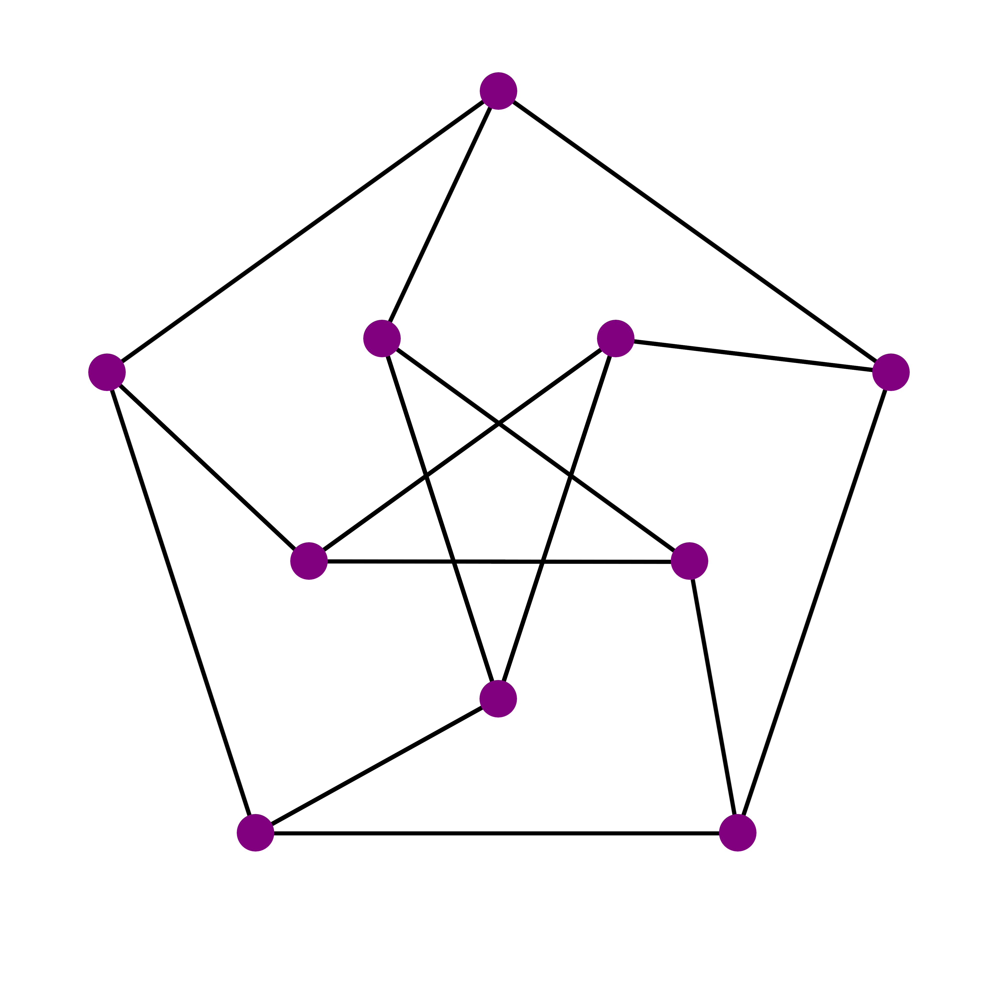

<table>
    <thead>
        <tr>
            <th>Logo</th>
            <th>Title</th>
            <th>Description</th>
            <th>References</th>
        </tr>
    </thead>
    <tbody>
         <tr>
            <td></td>
            <td>
              CAUS
              
              Active
              
            </td>
            <td>Group founded by students from the University of Seville with the aim of learning and improving programming skills through collaboration and participation in competitions.</td>
            <td><a target="_blank" href="https://clubalgoritmiaus.es/">site</a></td>
        </tr>
    </tbody>
</table>