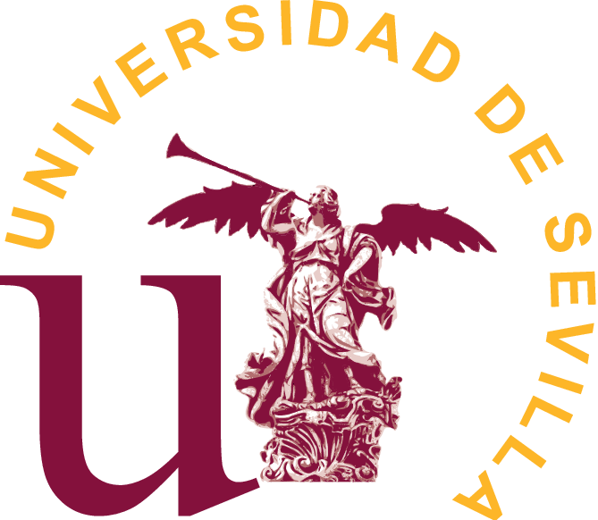

## Professional Experience

### [January 2024 - Present] AI Researcher - HYBLICON Project
**MP Ascensores (in collaboration with Org. of Industrial and Business Management II, University of Seville)**

- Development of cloud-based AI algorithms to optimize elevator operation through learning building usage patterns.
- Implementation of machine learning techniques for dynamic elevator behavior adjustment, enhancing user experience and reducing energy consumption.
- **Technologies:**
  
     Python 
     NumPy 
     Pandas 
     scikit-learn 
     PyTorch 
     Lightning 
     Matplotlib 
     Seaborn 
     Optuna 
     Gradio 
  
- **Models:** Recurrent Neural Networks (*RNN, LSTM, GRU*), XGBoost.

---

### [September 2023 - January 2024] AI Researcher - INARI Project
**GRI Renewable Industries and Redes (in collaboration with Org. of Industrial and Business Management II, University of Seville)**

- Research and development of AI models and neural networks for cost prediction of manufacturing complex wind components.
- Implementation of intelligent product digital models, experimental project flow control environments, and advanced cost simulation.
- Machine learning models applied to *lead time* and consumable cost prediction in Seville and Brazil factories.
- **Technologies:**
  
     Python 
     NumPy 
     Pandas 
     scikit-learn 
     pytorch_tabular 
     Matplotlib 
     Seaborn 
     PyCaret 
     Gradio 
  
- **Models:** Machine Learning models (XGBoost, Random Forest, etc.) and Deep Learning for tabular data (*TabNet, NODE*).
- **Publication:** Results led to the research article *Lead-Time Prediction in Wind Tower Manufacturing*.

---

### [March 2023 - September 2023] AI Researcher - OFFSHOREWIND Project
**GRI Renewable Industries (in collaboration with Org. of Industrial and Business Management II, University of Seville)**

- Research and development of machine learning algorithms for optimal task sequencing, improving efficiency in wind tower production in the Seville factory.
- **Technologies:**
  
     Python 
     NumPy 
     Pandas 
     Matplotlib 
     Seaborn 
     scikit-learn 
     Gradio 
  
- **Models:** Traditional Machine Learning models (decision trees, ensemble learning, MLP, among others).
- **Award:** Recipient of the [AEIPRO - IPMA Spain Project Excellence Award](https://www.aeipro.com/enoticias/158-proyectos-premiados/1472-offshorewind.html) in the Change Management/Product Development category.

<!-- 



[2004–2006] 


Involved in applied research projects, integrating artificial intelligence solutions in industrial environments and developing technologies tailored to specific contexts Contributed to scientific dissemination through article publications and conference presentations on industrial AI applications
 

<h3>HYBLICON Project - In collaboration with MP Ascensores (January 2024 - Present)</h3>

<ul>
    <li>Development of cloud-based AI algorithms to optimize elevator operationthrough learning building usage patterns</li>
    <li>Implementation of machine learning techniques for dynamic elevator behavioadjustment, enhancing user experience and reducing energy consumption</li>
    <li><strong>Technologies:</strong> 
        
         Python 
         NumPy 
         Pandas 
         scikit-learn 
         PyTorch 
         Lightning 
         Matplotlib 
         Seaborn 
         Optuna 
         Gradio 
        
    </li>
    <li><strong>Models:</strong> Recurrent Neural Networks (<em>RNN, LSTM, GRU</em>) XGBoost</li>
</ul>

<h3>INARI Project</strong> - In collaboration with GRI Renewable Industries and Redes (September 2023 - January 2024)</h3>

<ul>
    <li>Research and development of AI models and neural networks for cost predictioof manufacturing complex wind components</li>
    <li>Implementation of intelligent product digital models, experimental projecflow control environments, and advanced cost simulation</li>
    <li>Machine learning models applied to <em>lead time</em> and consumable cosprediction in Seville and Brazil factories</li>
    <li><strong>Technologies:</strong> 
        
         Python 
         NumPy 
         Pandas 
         scikit-learn 
         pytorch_tabular 
         Matplotlib 
         Seaborn 
         PyCaret 
         Gradio 
        
    </li>
    <li><strong>Models:</strong> Machine Learning models (XGBoost, Random Forestetc) and Deep Learning for tabular data (<em>TabNet, NODE</em>)</li>
    <li><strong>Publication:</strong> Results led to the research articl<em>Lead-Time Prediction in Wind Tower Manufacturing</em></li>
</ul>

<h3>OFFSHOREWIND Project - In collaboration with GRI Renewable Industries (March - September 2023)</h3>

<ul>
    <li>Research and development of machine learning algorithms for optimal tassequencing, improving efficiency in wind tower production in the Seville factor</li>
    <li><strong>Technologies:</strong> 
        
         Python 
         NumPy 
         Pandas 
         Matplotlib 
         Seaborn 
         scikit-learn 
         Gradio 
        
    </li>
    <li><strong>Models:</strong> Traditional Machine Learning models (decision trees ensemble learning, MLP, among others)</li>
    <li><strong>Award:</strong> Recipient of the <a href="https://wwwaeiprocom/enoticias/158-proyectos-premiados/1472-offshorewindhtml">AEIPRO - IPMA Spain Project Excellence Award</a> in the Change Management/Product Development category</li>
</ul>



 -->

## Education

<table>
    <thead>
        <tr>
            <th>School</th>
            <th>Link</th>
            <th>Degree</th>
            <th>Date</th>
        </tr>
    </thead>
    <tbody>
        <tr>
            <td rowspan=4></td>
            <td rowspan=4><a href="https://www.us.es/" target="_blank">University of Seville </a></td>
        </tr>
        <tr>
            <td>PhD in Mechanical and Industrial Organisation Engineering</td>
            <td>2024</td>
        </tr>
        <tr>
            <td>Master's Degree in Logic, Computation and AI</td>
            <td>2022</td>
        </tr>
        <tr>
            <td>Bachelor’s Degree in Computer Science</td>
            <td>2018</td>
        </tr>
    </tbody>
</table>

<!-- 







 -->

## Relevant Certifications

- **Fundamentals of Accelerated Data Science** (NVIDIA)
- **Fundamentals of Deep Learning** (NVIDIA)
- **Microsoft Certified: Azure Fundamentals** (Microsoft)
- **Fundamentals of Accelerated Computing with CUDA Python** (NVIDIA)

## Skills

<ul>
    <li><strong>Programming Languages:</strong>  
        
         Python 
         SQL 
         Julia 
         Haskell 
        
    </li>
    <li><strong>Frameworks:</strong>  
        
         PyTorch 
         OpenCV 
         scikit-learn 
         Pandas 
         NumPy 
         Matplotlib 
         Seaborn 
         Gradio 
        
    </li>
    <li><strong>Technologies:</strong>  
        
         Machine Learning 
         NLP 
         Computer Vision 
         Docker 
         Git 
         Linux 
        
    </li>
    <li><strong>Soft Skills:</strong>  
        
         Leadership 
         Teamwork 
         Open to new challenges 
        
    </li>
    <li><strong>Languages:</strong>  
        
         Spanish (Native) 
         English (B2) 
         French (B1) 
         German (B1) 
        
    </li>
</ul>
